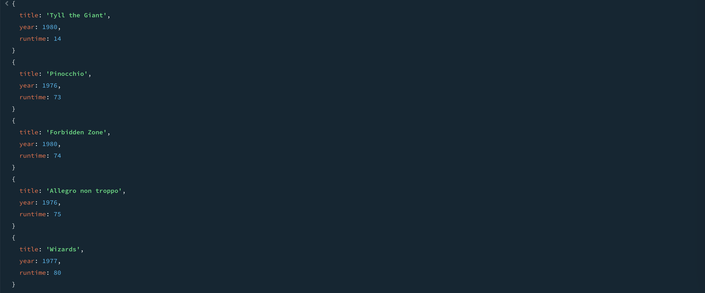
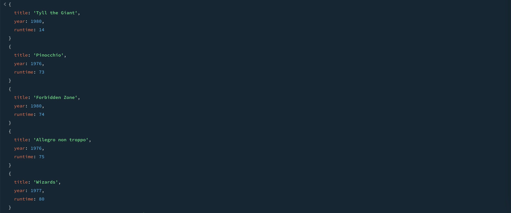

# Homework 3: Data Pipelines

## MongoDB

1. Figure out what the schema of the collection is.

```javascript
> db.embedded_movies.find().limit(1)

< {
  _id: ObjectId("573a1390f29313caabcd5293"),
  plot: "Young Pauline is left a lot of money when her wealthy uncle dies. However, her uncle's secretary has been named as her guardian until she marries, at which time she will officially take ...",
  genres: [
    'Action'
  ],
  runtime: 199,
  cast: [
    'Pearl White',
    'Crane Wilbur',
    'Paul Panzer',
    'Edward Josè'
  ],
  num_mflix_comments: 0,
  poster: 'https://m.media-amazon.com/images/M/MV5BMzgxODk1Mzk2Ml5BMl5BanBnXkFtZTgwMDg0NzkwMjE@._V1_SY1000_SX677_AL_.jpg',
  title: 'The Perils of Pauline',
  fullplot: `Young Pauline is left a lot of money when her wealthy uncle dies. However, her uncle's secretary has been named as her guardian until she marries, at which time she will officially take possession of her inheritance. Meanwhile, her "guardian" and his confederates constantly come up with schemes to get rid of Pauline so that he can get his hands on the money himself.`,
  languages: [
    'English'
  ],
  released: 1914-03-23T00:00:00.000Z,
  directors: [
    'Louis J. Gasnier',
    'Donald MacKenzie'
  ],
...
```

2. Query that captures the following requirements:
   1. Movies with `year` between 1975 and 1980.
   2. Display only 3 columns `title`, `year` and `runtime`.
   3. Order by `runtime` (asc or dsc).

```javascript
> db.embedded_movies.aggregate([
  {
    $match: {
      year: { $gt: 1975, $lt: 1980 }
    }
  },
  {
    $sort: { runtime: 1 }
  },
  {
    $limit: 5
  },
  {
    $project: {
      title: 1,
      year: 1,
      runtime: 1,
      _id: 0
    }
  },
  {
    $project: {
      title: "$title",
      year: "$year",
      runtime: "$runtime"
    }
  }
])

> {
  title: 'Pinocchio',
  year: 1976,
  runtime: 73
}
{
  title: 'Allegro non troppo',
  year: 1976,
  runtime: 75
}
{
  title: 'Wizards',
  year: 1977,
  runtime: 80
}
{
  title: 'Nutcracker Fantasy',
  year: 1979,
  runtime: 82
}
{
  title: 'The Twelve Tasks of Asterix',
  year: 1976,
  runtime: 82
}
```

The output from the MongoDB compass:



Note that some movies don't have a `runtime`, which is why they're not being displayed.

There's a script called `retrieve_movies.js` that can be run using `node`. Ensure that you create a file called `db_creds.json` before you run the file. The output is given in `movies_query_results.json`, this includes all the movies without any limit.

3. Write an aggregation aggregating year which calculates sum of all runtime for movies where year is between 1975 and 1980 (inclusive).
   
```bash
> db.embedded_movies.aggregate([
  {
    $match: {
      year: { $gte: 1975, $lte: 1980 }
    }
  },
  {
    $group: {
      _id: "$year",
      sumRuntime: { $sum: "$runtime" }
    }
  },
  {
    $project: {
      _id: 0,
      year: "$_id",
      sumRuntime: "$sumRuntime"
    }
  }
]).sort({ year: 1 })

< {
  year: 1975,
  sumRuntime: 2314
}
{
  year: 1976,
  sumRuntime: 1892
}
{
  year: 1977,
  sumRuntime: 2097
}
{
  year: 1978,
  sumRuntime: 3471
}
{
  year: 1979,
  sumRuntime: 1440
}
{
  year: 1980,
  sumRuntime: 3303
}
```

The output from the MongoDB compass:



## Spark Databriks

* Notebook that was used can be found in `Databricks_Exercise.ipynb`.
* You can also find the notebook published on [databricks-prod-cloudfront](https://databricks-prod-cloudfront.cloud.databricks.com/public/4027ec902e239c93eaaa8714f173bcfc/5464819398435225/2786829960718927/6325479124959666/latest.html)
* Output for "Display top 5 rows ordered in ascending order by `age` and ascending order by `education_num`" is given below.
* We're using SparkSQL instead of PySpark.

```python
display(spark.sql("SELECT * FROM adult ORDER BY age asc, education_num asc LIMIT 5"))
```

| age | workclass | fnlwgt | education | education_num | marital_status | occupation      | relationship   | race  | sex  | capital_gain | capital_loss | hours_per_week | native_country | income |
| --- | --------- | ------ | --------- | ------------- | -------------- | --------------- | -------------- | ----- | ---- | ------------ | ------------ | -------------- | -------------- | ------ |
| 17  | Private   | 270942 | 5th-6th   | 3             | Never-married  | Other-service   | Other-relative | White | Male | 0            | 0            | 48             | Mexico         | <=50K  |
| 17  | Private   | 168807 | 7th-8th   | 4             | Never-married  | Craft-repair    | Not-in-family  | White | Male | 0            | 0            | 45             | United-States  | <=50K  |
| 17  | Private   | 168203 | 7th-8th   | 4             | Never-married  | Farming-fishing | Other-relative | Other | Male | 0            | 0            | 40             | Mexico         | <=50K  |
| 17  | Private   | 46402  | 7th-8th   | 4             | Never-married  | Sales           | Own-child      | White | Male | 0            | 0            | 8              | United-States  | <=50K  |
| 17  | ?         | 127003 | 9th       | 5             | Never-married  | ?               | Own-child      | Black | Male | 0            | 0            | 40             | United-States  | <=50K  |

Output from the Databricks Notebook:


